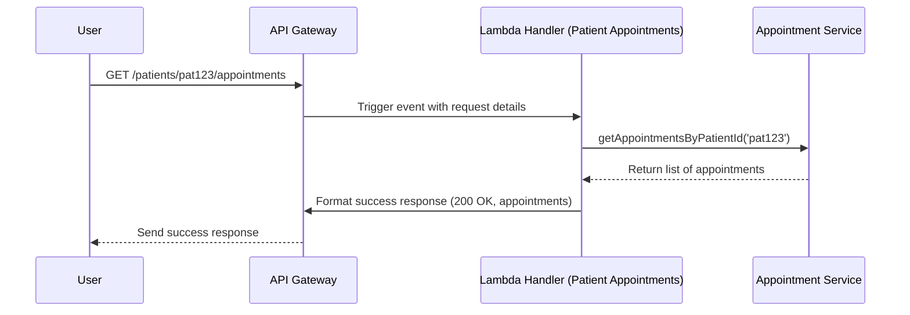

# Chapter 1: Lambda Handler (Patient Appointments)

Welcome! This is the first chapter in our journey to understand the `aws-sam-typescript-bootstrap` project. We'll start with a core component: the **Lambda Handler** responsible for fetching patient appointments.

Imagine you're building a system for a clinic. One essential feature is allowing staff (or maybe even patients someday!) to quickly look up upcoming appointments for a specific patient. How does the system handle such a request? That's where our Lambda Handler comes in.

## What's the Problem?

When someone (or another computer program) needs information from our system, like "Get all appointments for Patient ID 'pat123'", they send a request over the internet. Our application needs a specific entry point to receive this request, understand what's being asked, process it, and send back a response.

Think of it like a clinic's reception desk. When you call, the receptionist answers (**entry point**), asks for your details (**extracts information**), finds the right person or department to help (**delegates work**), and then gives you the answer or connects you (**sends response**).

## What is a Lambda Handler?

In the world of AWS Lambda (a service that lets you run code without managing servers), a **Handler** is the specific function that AWS Lambda executes when the service is triggered.

In our case, the `patient-appointments` Lambda function is triggered when someone makes a web request (via an API Gateway) to a specific URL, like `/patients/{patientId}/appointments`. The `lambdaHandler` function inside our code is the designated starting point for handling that request.

Its main jobs are:

1.  **Receive the Request:** Get the incoming data (like the patient ID from the URL).
2.  **Validate & Extract:** Check if necessary information (like the patient ID) is present.
3.  **Delegate:** Ask another part of our system (the [Appointment Service](03_appointment_service_.md)) to fetch the actual appointment data.
4.  **Respond:** Format the results (or any errors) into a proper web response and send it back.

## How it Works: The Flow

Let's trace a simple request:

1.  A user (or application) sends a request like `GET /patients/pat123/appointments` to our API endpoint.
2.  AWS API Gateway receives this request and triggers our `patient-appointments` Lambda function.
3.  AWS Lambda executes the `lambdaHandler` function within our code, passing in details about the request (the `event` object).
4.  Our `lambdaHandler` extracts the `patientId` (`pat123`) from the request details.
5.  It calls the [Appointment Service](03_appointment_service_.md), asking it to find appointments for `pat123`.
6.  The [Appointment Service](03_appointment_service_.md) does its magic (we'll cover that in Chapter 3!) and returns a list of appointments.
7.  Our `lambdaHandler` takes this list, packages it into a successful HTTP response (status code 200), and returns it.
8.  API Gateway sends this response back to the original user/application.

Here's a simplified diagram showing the main actors:



## Looking at the Code (`patient-appointments.ts`)

Let's examine the code that makes this happen. You can find it in `src/command/lambda/patient-appointments.ts`.

**1. Setting up:**

```typescript
import { APIGatewayProxyEvent, APIGatewayProxyResult } from 'aws-lambda';
import { MockAppointmentRepository } from '@/infrastructure/mock-appointment-repository';
import { AppointmentService } from '@/application/appointment-service';
import { logger } from '@/utils/logger';

// Dependencies needed by the handler
const appointmentRepository = new MockAppointmentRepository(); // Temporary data store
const appointmentService = new AppointmentService(appointmentRepository); // Logic handler
```

This part imports necessary tools and sets up the [Appointment Service](03_appointment_service_.md). We'll learn more about the [Mock Appointment Repository](05_mock_appointment_repository_.md) and [Logger Utility](06_logger_utility_.md) in later chapters. For now, just know they help the handler do its job.

**2. The Handler Function:**

```typescript
export const lambdaHandler = async (event: APIGatewayProxyEvent): Promise<APIGatewayProxyResult> => {
    logger.info('Received event', { event }); // Log the incoming request

    // ... main logic inside try/catch ...
};
```

This defines the main function `lambdaHandler`. It takes an `event` object (containing request details like the path) and is expected to return a `Promise` resolving to an `APIGatewayProxyResult` (the HTTP response). We also log the incoming event using our [Logger Utility](06_logger_utility_.md).

**3. Getting the Patient ID:**

```typescript
    try {
        const patientId = event.pathParameters?.patientId;

        if (!patientId) {
            // Handle missing patientId (Error case 1)
            // ... return 400 error response ...
        }
        // ... rest of the try block ...
```

Inside a `try` block (to catch potential errors), we attempt to get the `patientId` from the `event`'s `pathParameters`. If it's not found (`!patientId`), we know the request is invalid.

**4. Handling Missing Patient ID:**

```typescript
        if (!patientId) {
            logger.error('Patient ID is missing');
            return {
                statusCode: 400, // Bad Request
                headers: headers, // Standard response headers
                body: JSON.stringify({ message: 'Patient ID is missing' }),
            };
        }
```

If `patientId` is missing, we log an error and immediately return an error response with status code `400` (Bad Request) and a helpful message.

**5. Calling the Service:**

```typescript
        // If patientId exists:
        const appointments = await appointmentService.getAppointmentsByPatientId(patientId);
        logger.info('Appointments retrieved', { patientId, count: appointments.length });

        // ... return success response ...
```

If we have a `patientId`, we call the `getAppointmentsByPatientId` method on our `appointmentService`, passing the ID. We `await` the result because fetching data might take time. Then, we log that we successfully got the appointments.

**6. Sending the Success Response:**

```typescript
        return {
            statusCode: 200, // OK
            headers: headers,
            body: JSON.stringify(appointments), // Put appointments list in the response body
        };
    } catch (err) {
        // Handle unexpected errors (Error case 2)
        // ... return 500 error response ...
    }
```

If everything goes well, we return a success response: status code `200` (OK) and the list of `appointments` (converted to a JSON string) in the `body`.

**7. Handling Unexpected Errors:**

```typescript
    } catch (err) {
        logger.error('Error retrieving appointments', { error: err });

        const errorMessage = err instanceof Error ? err.message : 'Unknown error';
        return {
            statusCode: 500, // Internal Server Error
            headers: headers,
            body: JSON.stringify({ message: errorMessage }),
        };
    }
```

The `catch (err)` block handles any unexpected errors that might occur in the `try` block (e.g., if the `appointmentService` fails). We log the error and return a generic `500` (Internal Server Error) response, including the error message if available.

## Testing the Handler

How do we know the handler works correctly in different situations? We write tests! The file `src/tests/unit/command/patient-appointments.test.ts` contains tests for our handler.

Look at these test descriptions:

*   `it('should return 200 and appointments for valid patient ID', ...)`: Checks the "happy path" where everything works.
*   `it('should return 400 if patient ID is missing', ...)`: Checks if it correctly handles the missing `patientId` error.
*   `it('should return 500 if there is an error', ...)`: Checks if it correctly handles unexpected errors from the service.

These tests automatically run our `lambdaHandler` with simulated inputs (`event`) and check if the output (`APIGatewayProxyResult`) matches what we expect. We'll dive deeper into [Testing Configuration (Jest)](07_testing_configuration__jest__.md) in a later chapter.

## Conclusion

We've learned that the Lambda Handler (`patient-appointments.ts`) acts as the main entry point for API requests wanting patient appointments. It's like a receptionist: it receives the request, validates it, delegates the actual work to the [Appointment Service](03_appointment_service_.md), and then formats and sends back the appropriate response (either the requested data or an error message).

But what exactly *is* an "Appointment"? How do we represent that data in our code? That leads us to our next topic.

Next up: [Domain Model (Appointment, Patient)](02_domain_model__appointment__patient__.md)

---

Generated by [AI Codebase Knowledge Builder](https://github.com/The-Pocket/Tutorial-Codebase-Knowledge)