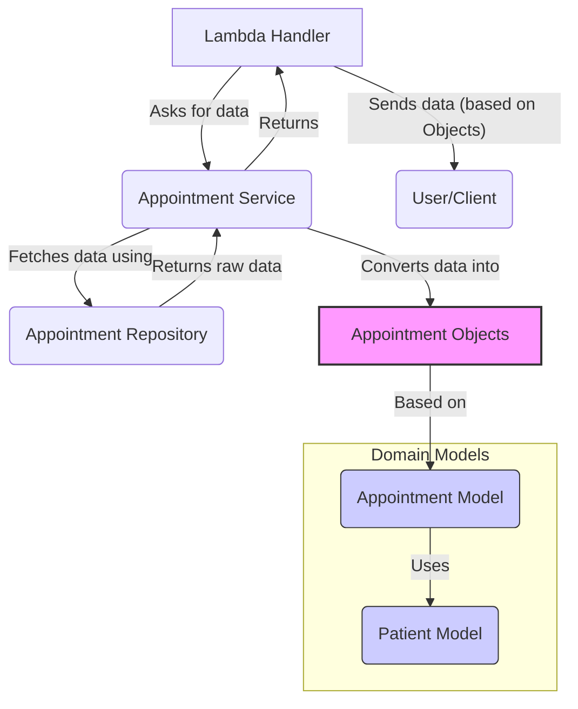

# Chapter 2: Domain Model (Appointment, Patient)

In the [previous chapter](01_lambda_handler__patient_appointments__.md), we saw how the Lambda Handler acts like a receptionist, taking requests for patient appointments. But when the handler gets the appointment information back from the service, what does that information *look like*? How does our code represent the idea of a "Patient" or an "Appointment"?

That's where our **Domain Model** comes in!

## What's the Problem?

Imagine you're building with LEGOs. You have different types of bricks: small red ones, long blue ones, flat green ones. You need clear definitions for each type so you know what they are and how they fit together.

Similarly, in our clinic application, we deal with core concepts like "Patients" and "Appointments". We need a clear, consistent way to define what these concepts mean within our code. What information does every `Patient` have? What details make up an `Appointment`? If we don't define these clearly, different parts of our code might handle them differently, leading to confusion and bugs.

## What is a Domain Model?

The **Domain Model** is like the set of **blueprints** or **definitions** for the most important concepts in our application. Think of them as the essential "nouns" in our system's language.

*   **`Patient` Model:** Defines what constitutes a patient in our system.
*   **`Appointment` Model:** Defines what constitutes an appointment.

These models ensure that whenever we talk about a "Patient" in our code, we always mean something with a specific structure (e.g., it *must* have an ID and a name). All other parts of the application, like the [Lambda Handler (Patient Appointments)](01_lambda_handler__patient_appointments__.md) and the [Appointment Service](03_appointment_service_.md), will use these blueprints to understand and work with patient and appointment data.

## Our Blueprints: `Patient` and `Appointment`

Let's look at the blueprints defined in our code.

### 1. The `Patient` Blueprint (`src/domain/patient.ts`)

What information do we *always* need to identify a patient? In our simple system, it's their unique ID and their name.

```typescript
// File: src/domain/patient.ts
export class Patient {
    constructor(
        public id: string,
        public name: string
    ) {}
}
```

*   **`export class Patient { ... }`**: This line declares a blueprint named `Patient`. The `export` keyword means other parts of our code can use this blueprint.
*   **`constructor(...) { ... }`**: This is like the instruction manual for creating a new `Patient` object. It says that to create a `Patient`, you *must* provide an `id` (which is text, or `string`) and a `name` (also text).
*   **`public id: string`**: This declares that every `Patient` will have a property called `id`, and it will store text. `public` means it's easily accessible.
*   **`public name: string`**: Similarly, every `Patient` will have a `name` property storing text.

**Example Usage:**

If we wanted to represent a patient named "John Doe" with ID "pat123" in our code, we'd use this blueprint like so:

```typescript
import { Patient } from './patient'; // Import the blueprint

// Create a new Patient object using the blueprint
const john = new Patient('pat123', 'John Doe');

console.log(john.id);   // Output: pat123
console.log(john.name); // Output: John Doe
```

### 2. The `Appointment` Blueprint (`src/domain/appointment.ts`)

Now, what defines an appointment? We need:

*   A unique ID for the appointment itself.
*   Its current status (e.g., "booked", "cancelled").
*   *Which* patient the appointment is for (using our `Patient` blueprint!).
*   When it starts and ends.

```typescript
// File: src/domain/appointment.ts
import { Patient } from './patient'; // We need the Patient blueprint!

export class Appointment {
    constructor(
        public id: string,
        public status: string,
        public subject: Patient, // Uses the Patient blueprint!
        public start: string,   // Using string for simplicity here
        public end: string
    ) {}
    // ... more code below ...
}
```

*   **`import { Patient } from './patient';`**: We first import the `Patient` blueprint because an `Appointment` involves a `Patient`.
*   **`export class Appointment { ... }`**: Declares the `Appointment` blueprint.
*   **`constructor(...)`**: The instruction manual. To create an `Appointment`, you need an `id`, `status`, `start` time, `end` time, and crucially, a `subject`.
*   **`public subject: Patient`**: This is key! It says every `Appointment` must have a `subject` property, and the value stored there *must* be an object created using the `Patient` blueprint. This links appointments directly to patients.
*   **`public start: string`, `public end: string`**: We're storing the times as simple text strings for now.

The `Appointment` blueprint also includes a small helper function:

```typescript
// Still inside the Appointment class...

    hasSubject(id: string): boolean {
        return this.subject.id === id;
    }
```

*   **`hasSubject(id: string): boolean`**: This is a small tool built into every `Appointment` object. You give it a patient ID (text), and it tells you (`true` or `false`) if *this specific appointment* belongs to the patient with that ID. It checks if the `id` of the appointment's `subject` (the `Patient` object linked to the appointment) matches the `id` you provided.

**Example Usage:**

Let's create an appointment for our patient "John Doe" (`john`).

```typescript
import { Appointment } from './appointment';
import { Patient } from './patient';

// First, create the patient
const john = new Patient('pat123', 'John Doe');

// Now, create an appointment FOR John
const johnsAppointment = new Appointment(
    'appt001',          // Appointment ID
    'booked',           // Status
    john,               // The Patient object!
    '2023-10-26T10:00:00Z', // Start time
    '2023-10-26T10:30:00Z'  // End time
);

console.log(johnsAppointment.status);     // Output: booked
console.log(johnsAppointment.subject.name); // Output: John Doe
console.log(johnsAppointment.hasSubject('pat123')); // Output: true
console.log(johnsAppointment.hasSubject('pat999')); // Output: false
```

## How These Blueprints Are Used

These `Patient` and `Appointment` classes act as the common language for data across our application.



1.  The [Appointment Service](03_appointment_service_.md) uses these models to structure the data it gets from storage (like the [Mock Appointment Repository](05_mock_appointment_repository_.md)).
2.  When the [Appointment Service](03_appointment_service_.md) returns data to the [Lambda Handler (Patient Appointments)](01_lambda_handler__patient_appointments__.md), it returns a list of `Appointment` objects.
3.  The Lambda Handler knows exactly what properties to expect on these objects (like `id`, `status`, `subject`, etc.) because they follow the `Appointment` blueprint.
4.  Even our tests (like `appointment-service.test.ts`) use these models to create fake data and check if the service behaves correctly.

Using these models makes our code:

*   **Clearer:** Everyone knows what a "Patient" or "Appointment" means.
*   **Safer:** TypeScript helps ensure we don't accidentally try to access a property that doesn't exist (like `appointment.patientName` instead of `appointment.subject.name`).
*   **Easier to Maintain:** If we need to add information (like a patient's date of birth), we update the `Patient` blueprint in one place.

## Conclusion

We've learned that **Domain Models** like `Patient` and `Appointment` are fundamental blueprints that define the structure of the core concepts (the "nouns") in our application. They act as a shared language, ensuring consistency and clarity when different parts of the system work with data.

These models don't *do* much on their own – they primarily define structure. But how do we actually perform actions like *finding* or *creating* appointments based on these models? That's the job of the service layer.

Next up: [Appointment Service](03_appointment_service_.md)

---

Generated by [AI Codebase Knowledge Builder](https://github.com/The-Pocket/Tutorial-Codebase-Knowledge)