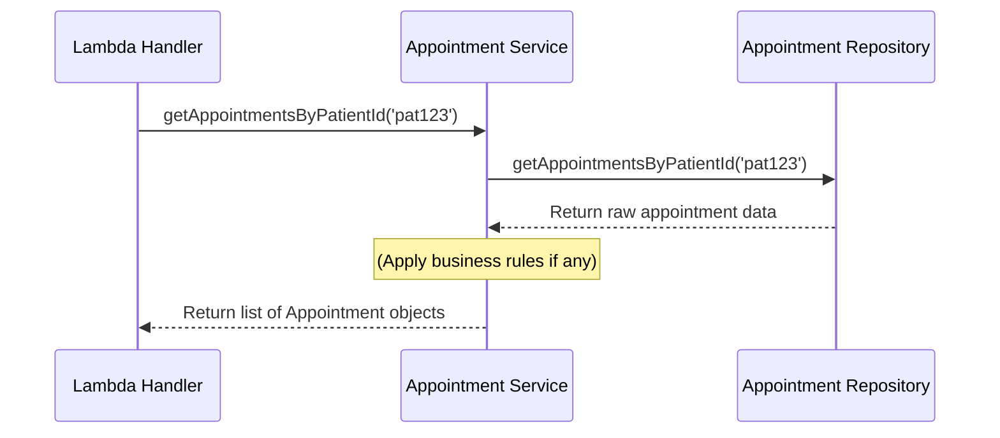

# Chapter 3: Appointment Service

In the [previous chapter](02_domain_model__appointment__patient__.md), we defined the blueprints for our core concepts: `Patient` and `Appointment`. We now have a clear structure for our data. But who is responsible for actually *doing* things with this data, like finding all appointments for a specific patient?

Our [Lambda Handler (Patient Appointments)](01_lambda_handler__patient_appointments__.md) acts as the entry point, like a receptionist. But the receptionist doesn't personally go dig through filing cabinets. They delegate the task to someone who knows the procedures. That's where the **Appointment Service** comes in!

## What's the Problem?

The Lambda Handler knows *what* the user wants (e.g., "appointments for patient pat123"). However, it shouldn't need to know *how* to get that data.

*   Where is the appointment data stored? (A database? A simple file? Somewhere else?)
*   Are there any rules about which appointments to return? (Maybe only show future appointments? Or hide cancelled ones?)
*   What if fetching data involves multiple steps?

If we put all this logic directly into the Lambda Handler, it would become very complex and hard to manage. It would be like a receptionist also being the doctor, the nurse, and the billing department all rolled into one! We need separation.

## What is the Appointment Service?

Think of the **Appointment Service** as the **Clinic Coordinator** or the application's "brain" specifically for appointment-related tasks.

Its main jobs are:

1.  **Contain Business Logic:** It holds the rules and procedures related to appointments. For example, if we decided to only return 'booked' appointments in the future, that rule would live here.
2.  **Coordinate Data Access:** It knows it needs appointment data, but it doesn't fetch it directly. Instead, it asks another component, the [Appointment Repository Interface](04_appointment_repository_interface_.md) (which we'll cover next), to get the raw data.
3.  **Shield the Handler:** It hides the complexities of data storage and retrieval from the Lambda Handler. The Handler simply asks the Service, and the Service figures out how to get the answer.

This keeps our Handler clean and focused on handling web requests/responses, while the Service focuses on the "business" of appointments.

## How the Lambda Handler Uses It

Let's revisit a snippet from our [Lambda Handler (Patient Appointments)](01_lambda_handler__patient_appointments__.md):

**1. Setting up:**

```typescript
// File: src/command/lambda/patient-appointments.ts (Simplified)
import { AppointmentService } from '@/application/appointment-service';
// ... other imports ...
import { MockAppointmentRepository } from '@/infrastructure/mock-appointment-repository';

// Create the necessary components
const repository = new MockAppointmentRepository(); // How we'll get data
const appointmentService = new AppointmentService(repository); // Our coordinator
```

Here, we create an instance of the `AppointmentService`. Notice it needs something called a `repository` when it's created. This is like telling the coordinator which filing cabinet system (Repository) to use.

**2. Calling the Service:**

```typescript
// File: src/command/lambda/patient-appointments.ts (Inside the handler)

// Get the patient ID from the request (e.g., 'pat123')
const patientId = event.pathParameters?.patientId;

if (patientId) {
    // Ask the Appointment Service to do the work!
    const appointments = await appointmentService.getAppointmentsByPatientId(patientId);

    // Now 'appointments' holds the list we need for the response.
    // ... return success response with appointments ...
}
```

The Handler gets the `patientId` and simply calls the `getAppointmentsByPatientId` method on the `appointmentService` instance. It doesn't know *how* the service finds them, it just trusts the service to return the correct list of [Appointment](02_domain_model__appointment__patient__.md) objects.

## Under the Hood: How the Service Works

So, what happens inside the `AppointmentService` when the handler calls `getAppointmentsByPatientId`?

**The Flow:**

1.  **Receive Request:** The service's `getAppointmentsByPatientId` method receives the `patientId` from the Lambda Handler.
2.  **Validate Input (Optional but good practice):** It might check if the `patientId` looks valid (e.g., not empty).
3.  **Delegate to Repository:** The service uses the `AppointmentRepository` it was given when it was created. It calls a method on the repository (like `getAppointmentsByPatientId`) passing along the `patientId`.
4.  **Receive Raw Data:** The repository (which *does* know how to fetch data) finds the relevant appointments and returns them to the service.
5.  **Apply Business Rules (Optional):** The service could now filter or modify the data if needed (e.g., remove cancelled appointments). In our current simple version, it doesn't apply extra rules.
6.  **Return Results:** The service returns the final list of [Appointment](02_domain_model__appointment__patient__.md) objects back to the Lambda Handler.

Here's a diagram showing this interaction:



**Looking at the Code (`appointment-service.ts`)**

Let's examine the code for our coordinator. You can find it in `src/application/appointment-service.ts`.

**1. Setting Up (The Constructor):**

```typescript
// File: src/application/appointment-service.ts
import { Appointment } from '@/domain/appointment';
import { AppointmentRepository } from '@/infrastructure/appointment-repository'; // The contract!

export class AppointmentService {
    // Store the repository it will use
    constructor(private appointmentRepository: AppointmentRepository) {}

    // ... methods like getAppointmentsByPatientId go here ...
}
```

*   **`import { AppointmentRepository } ...`**: It imports the *interface* (the contract or blueprint) for a repository, not a specific implementation like the Mock one. This makes the service flexible – it can work with *any* repository that follows the contract.
*   **`constructor(private appointmentRepository: AppointmentRepository)`**: This is crucial. When you create an `AppointmentService`, you *must* give it something that fulfills the `AppointmentRepository` contract. The `private` keyword means it stores this repository for its own internal use.

**2. The `getAppointmentsByPatientId` Method:**

```typescript
// File: src/application/appointment-service.ts (Inside the AppointmentService class)

    async getAppointmentsByPatientId(patientId: string): Promise<Appointment[]> {
        // 1. Basic validation
        if (!patientId) {
            throw new Error('Invalid patient ID');
        }

        // 2. Use the stored repository to fetch data
        const appointments = await this.appointmentRepository.getAppointmentsByPatientId(patientId);

        // 3. (No extra business logic here in our simple case)

        // 4. Return the results
        return appointments;
    }
```

*   **`async getAppointmentsByPatientId(...)`**: Defines the method the Handler calls. It takes the `patientId` string. `async` means it might perform operations that take time (like fetching data). It promises (`Promise<Appointment[]>`) to eventually return an array of `Appointment` objects.
*   **`if (!patientId)`**: A simple check to ensure a valid ID was provided.
*   **`await this.appointmentRepository.getAppointmentsByPatientId(patientId)`**: This is the core delegation step. It calls the corresponding method on the repository instance (`this.appointmentRepository`) that was passed into the constructor. It uses `await` because fetching data is asynchronous.
*   **`return appointments;`**: It returns the list of appointments received from the repository.

## Why Bother? The Benefits

Separating the Appointment Service gives us:

*   **Clear Responsibilities:** The Handler handles HTTP, the Service handles business logic/coordination, and the Repository handles data storage interaction.
*   **Testability:** We can test the Service's logic separately by giving it a fake (mock) repository, without needing a real database. You can see this in `src/tests/unit/application/appointment-service.test.ts`.
*   **Flexibility:** If we change where or how we store data (e.g., move from a mock repository to a real database), we only need to update the Repository implementation. The Service and Handler don't need to change, as long as the new repository fulfills the same contract.
*   **Maintainability:** Business rules are centralized in the Service, making them easier to find and update.

## Conclusion

The **Appointment Service** acts as a vital coordinator, sitting between the entry point (Lambda Handler) and the data access layer (Repository). It encapsulates business logic and orchestrates the process of fulfilling requests, like getting appointments for a patient. It achieves this by delegating the actual data fetching to an implementation of the [Appointment Repository Interface](04_appointment_repository_interface_.md).

But what exactly *is* this "Appointment Repository Interface"? How does it define the contract for data access? Let's explore that next.

Next up: [Appointment Repository Interface](04_appointment_repository_interface_.md)

---

Generated by [AI Codebase Knowledge Builder](https://github.com/The-Pocket/Tutorial-Codebase-Knowledge)