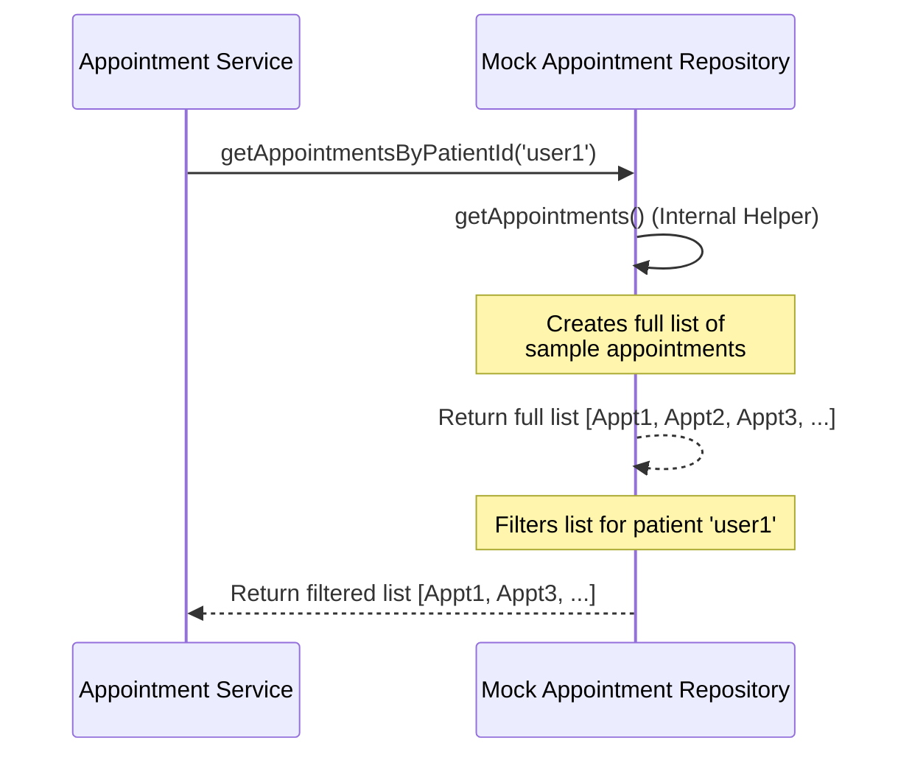

# Chapter 5: Mock Appointment Repository

In the [previous chapter](04_appointment_repository_interface_.md), we defined the `AppointmentRepository` interface – a contract specifying *what* methods are needed to get appointment data, but not *how* they work. This is great for flexibility, but now we need an *actual* way to get some data so our application can run!

## What's the Problem? Needing Data Without a Database

Imagine you're building a car. You've designed the engine ([Appointment Service](03_appointment_service_.md)) and the dashboard controls ([Lambda Handler (Patient Appointments)](01_lambda_handler__patient_appointments__.md)). Now, you want to test if pressing the accelerator pedal actually makes the engine speed up *in your workshop*. You don't want to hook it up to a real, complex fuel tank and exhaust system just yet. You need a simple, temporary fuel source right there in the workshop.

Similarly, when we're developing or testing our appointment scheduling application, we want to run it and see if the [Lambda Handler (Patient Appointments)](01_lambda_handler__patient_appointments__.md) and [Appointment Service](03_appointment_service_.md) work correctly. But setting up and connecting to a real database can be complicated and slow, especially early on. We need a simple, readily available source of "fake" appointment data to work with.

## What is the Mock Appointment Repository?

The **Mock Appointment Repository** is our simple, temporary "fuel source". It's a specific class that *implements* (follows the rules of) the [Appointment Repository Interface](04_appointment_repository_interface_.md).

Instead of connecting to a real database, it holds a predefined list of sample [Appointment](02_domain_model__appointment__patient__.md) objects directly within its code (in memory).

Think of it like using lightweight cardboard props during a play rehearsal instead of the heavy, real furniture. It lets the actors (our application components) practice their roles without the complexity of handling the real thing.

Its main purpose is:

1.  **Provide Data:** Offer sample appointment data instantly.
2.  **Fulfill the Contract:** Act exactly like the [Appointment Repository Interface](04_appointment_repository_interface_.md) expects, so the [Appointment Service](03_appointment_service_.md) can use it without knowing it's "fake".
3.  **Enable Development & Testing:** Allow the application to run and be tested without needing a live database connection.

## Fulfilling the Contract: The Implementation

Let's look at the code that provides this mock data. You can find it in `src/infrastructure/mock-appointment-repository.ts`.

**1. Declaring the Class and Implementing the Interface:**

```typescript
// File: src/infrastructure/mock-appointment-repository.ts
import { Appointment } from '@/domain/appointment';
import { Patient } from '@/domain/patient';
// Import the contract!
import { AppointmentRepository } from './appointment-repository';

// Notice "implements AppointmentRepository" - it follows the contract!
export class MockAppointmentRepository implements AppointmentRepository {
    // ... methods go here ...
}
```

*   This code defines a class named `MockAppointmentRepository`.
*   Crucially, `implements AppointmentRepository` declares that this class promises to follow all the rules set out in the [Appointment Repository Interface](04_appointment_repository_interface_.md) contract.

**2. Implementing the Required Method:**

The [Appointment Repository Interface](04_appointment_repository_interface_.md) contract requires a method called `getAppointmentsByPatientId`. Here's how the mock repository provides it:

```typescript
// File: src/infrastructure/mock-appointment-repository.ts (Inside the class)

    async getAppointmentsByPatientId(patientId: string): Promise<Appointment[]> {
        // 1. Get all the hardcoded appointments
        const allAppointments = await this.getAppointments();

        // 2. Filter the list to find matches for the patientId
        const userAppointments = allAppointments.filter(
            (appointment) => appointment.hasSubject(patientId)
        );

        // 3. Return the matching appointments
        return userAppointments;
    }
```

*   This code defines the `getAppointmentsByPatientId` function, exactly as required by the interface (takes `patientId` string, returns `Promise<Appointment[]>`).
*   It first calls another helper function `this.getAppointments()` to get the full list of sample data.
*   It then uses the standard JavaScript `filter` method to keep only those appointments where the `appointment.hasSubject(patientId)` check (remember this from the [Appointment](02_domain_model__appointment__patient__.md) model?) returns `true`.
*   Finally, it returns the filtered list.

**3. The Sample Data Source (`getAppointments`):**

Where does the `getAppointments` function get the data? It's hardcoded right inside the method!

```typescript
// File: src/infrastructure/mock-appointment-repository.ts (Inside the class)

    async getAppointments(): Promise<Appointment[]> {
        // Create some sample Patient objects
        const patient1 = new Patient('user1', 'John Doe');
        const patient2 = new Patient('user2', 'Jane Doe');

        // Create a list of sample Appointment objects
        const appointments: Appointment[] = [
            new Appointment(/* appt 1 for John */ '1', 'booked', patient1, '...', '...'),
            new Appointment(/* appt 2 for Jane */ '2', 'Cancelled', patient2, '...', '...'),
            new Appointment(/* appt 3 for John */ '3', 'booked', patient1, '...', '...'),
            // ... many more sample appointments ...
        ];

        // Return the hardcoded list
        return appointments;
    }
```

*   This simple function creates a couple of `Patient` objects using our [Patient](02_domain_model__appointment__patient__.md) blueprint.
*   It then creates an array (`appointments`) filled with new `Appointment` objects, linking them to the sample patients. (The actual dates are simplified here with `...`).
*   It directly returns this predefined list. Every time `getAppointments` is called, it returns the exact same list.

## How It's Used: Plugging in the Mock

Remember how the [Lambda Handler (Patient Appointments)](01_lambda_handler__patient_appointments__.md) sets up the [Appointment Service](03_appointment_service_.md)?

```typescript
// File: src/command/lambda/patient-appointments.ts (Setup part)
import { MockAppointmentRepository } from '@/infrastructure/mock-appointment-repository';
import { AppointmentService } from '@/application/appointment-service';
// ... other imports ...

// Create an instance of the Mock Repository
const appointmentRepository = new MockAppointmentRepository();
// Give the Mock Repository to the Appointment Service
const appointmentService = new AppointmentService(appointmentRepository);
```

1.  We create a new `MockAppointmentRepository` object.
2.  We pass this object into the constructor of the `AppointmentService`.

Because `MockAppointmentRepository` *implements* the `AppointmentRepository` interface, the [Appointment Service](03_appointment_service_.md) accepts it happily. When the service later calls `appointmentRepository.getAppointmentsByPatientId(...)`, it's actually calling the method defined inside our `MockAppointmentRepository` class, which uses the hardcoded data.

## Under the Hood: The Mock Data Flow

Let's trace what happens when the [Appointment Service](03_appointment_service_.md) asks the `MockAppointmentRepository` for appointments for patient 'user1':

1.  **Request:** The [Appointment Service](03_appointment_service_.md) calls `mockRepo.getAppointmentsByPatientId('user1')`.
2.  **Internal Call:** The `getAppointmentsByPatientId` method inside `MockAppointmentRepository` starts running. It calls its own helper `this.getAppointments()`.
3.  **Get All Data:** The `getAppointments()` method creates and returns the *full list* of hardcoded appointments (for both John and Jane).
4.  **Filtering:** The `getAppointmentsByPatientId` method receives the full list. It iterates through it, checking each appointment:
    *   `appointment1.hasSubject('user1')`? -> Yes (keep)
    *   `appointment2.hasSubject('user1')`? -> No (discard)
    *   `appointment3.hasSubject('user1')`? -> Yes (keep)
    *   ... and so on.
5.  **Response:** The method finishes filtering and returns a new list containing only the appointments for 'user1' back to the [Appointment Service](03_appointment_service_.md).

Here's a simplified diagram:



## Why Use a Mock Repository?

*   **Fast Development:** Get your application running quickly without database setup hassles.
*   **Reliable Testing:** Tests ([Chapter 7](07_testing_configuration__jest__.md)) can rely on this consistent, predictable data source to verify application logic. You always know what data the tests will receive.
*   **Offline Work:** You can develop and test your application logic even without an internet connection (which might be needed for a cloud database).
*   **Isolation:** Test components like the [Appointment Service](03_appointment_service_.md) without worrying if a *real* database is down or has unexpected data.

## Conclusion

The **Mock Appointment Repository** is a simple yet powerful tool for development and testing. It acts as a stand-in for a real database by providing hardcoded, in-memory sample data. Crucially, it fulfills the contract defined by the [Appointment Repository Interface](04_appointment_repository_interface_.md), allowing components like the [Appointment Service](03_appointment_service_.md) to use it seamlessly. This enables us to build and test our application logic quickly and reliably, without the immediate need for a complex external database.

While the mock repository is great for getting started, our application often needs to log what's happening internally, especially when things go wrong. How do we add logging in a structured way?

Next up: [Logger Utility](06_logger_utility_.md)

---

Generated by [AI Codebase Knowledge Builder](https://github.com/The-Pocket/Tutorial-Codebase-Knowledge)