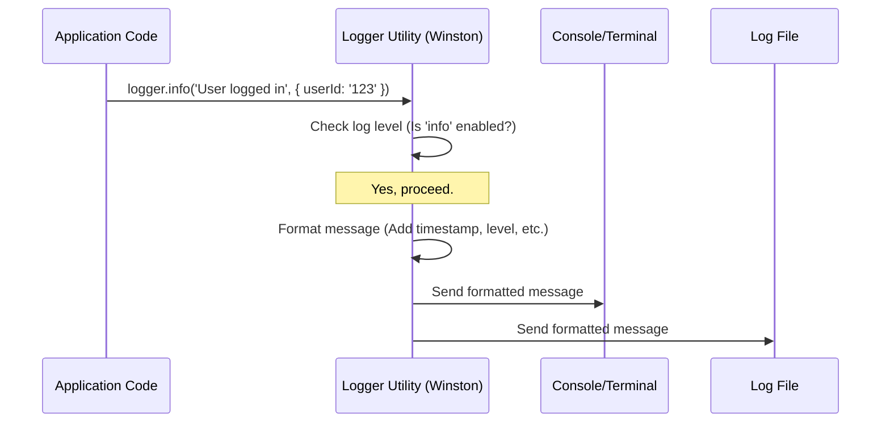

# Chapter 6: Logger Utility

In the [previous chapter](05_mock_appointment_repository_.md), we created a `MockAppointmentRepository` to provide sample data for our application during development and testing. This helps our application run, but how do we actually see what it's doing inside? Especially when it's running remotely on AWS, or when something goes wrong?

## What's the Problem? Flying Blind

Imagine your application is like an airplane flying high in the clouds. Everything seems fine from the outside, but you, the pilot (developer), need to know what's happening in the cockpit and the engine room. Is everything running smoothly? Did an unexpected warning light just turn on?

Without instruments or a way to record flight data, you're flying blind. Similarly, without a way to record events, information, and errors, running our application can feel like guesswork. If a user reports a problem, how do we trace back what happened?

## The Solution: The Application's Diary (Logger Utility)

This is where the **Logger Utility** comes in. Think of it as the application's **diary** or **flight recorder**. It's a standardized tool used throughout the application to write down important messages about what's happening.

*   **Informational Messages:** Recording normal events like "Received a request", "Fetched 5 appointments".
*   **Error Messages:** Recording problems like "Patient ID was missing", "Failed to connect to database".

These recorded messages (called "logs") help developers:

1.  **Understand Behaviour:** See the sequence of events as the application runs.
2.  **Diagnose Problems:** Pinpoint where and why errors occurred.
3.  **Monitor Health:** Check if the application is running smoothly in production.

Our project provides a ready-to-use logger instance, often simply called `logger`.

## How to Use the Logger

Using the logger is straightforward. First, you import it, and then you call specific methods on it to record messages.

**1. Importing the Logger:**

In any file where you want to log messages, you import the shared `logger` instance. For example, in our [Lambda Handler (Patient Appointments)](01_lambda_handler__patient_appointments__.md):

```typescript
// File: src/command/lambda/patient-appointments.ts
import { logger } from '@/utils/logger';
// ... other imports ...
```

This line imports the pre-configured logger utility from the `utils` folder.

**2. Logging Informational Messages (`logger.info`):**

To record a standard operational message (like "things are working as expected"), you use `logger.info()`:

```typescript
// File: src/command/lambda/patient-appointments.ts (inside lambdaHandler)
export const lambdaHandler = async (event: APIGatewayProxyEvent) => {
    // Log that we received an event, include the event data
    logger.info('Received event', { event });

    // ... rest of the handler logic ...
};
```

*   The first argument (`'Received event'`) is the main message text.
*   The second argument (optional) is an object `{ event }` containing extra details. The logger will often format this nicely (e.g., as JSON).

**3. Logging Errors (`logger.error`):**

When something goes wrong, you use `logger.error()` to record the error:

```typescript
// File: src/command/lambda/patient-appointments.ts (inside lambdaHandler)
try {
    const patientId = event.pathParameters?.patientId;
    if (!patientId) {
        // Log the specific error that occurred
        logger.error('Patient ID is missing');
        // ... return 400 error response ...
    }
    // ...
} catch (err) {
    // Log an unexpected error, include the error object
    logger.error('Error retrieving appointments', { error: err });
    // ... return 500 error response ...
}
```

*   Similar to `info`, the first argument is the message, and the second (optional) provides context, like the actual error object (`err`).

These log messages will be sent to configured destinations, like the console you see when running locally, or to cloud logging services (like AWS CloudWatch Logs) when deployed.

## Under the Hood: How the Logger Works

Our logger isn't magic; it's built using a popular logging library for Node.js called **Winston**. The file `src/utils/logger.ts` sets up a specific Winston configuration for our project.

**The Flow:**

1.  **Call:** Your code calls `logger.info(...)` or `logger.error(...)`.
2.  **Check Level:** The logger checks if the *level* of the message (e.g., 'info', 'error') is severe enough to be recorded based on its configuration. (e.g., if configured for 'error' level, 'info' messages are ignored).
3.  **Format:** If the level is accepted, the logger formats the message, often adding a timestamp, the log level itself, and any extra data provided.
4.  **Transport:** The formatted message is sent to all configured "transports" (destinations), such as the console or log files.



**Looking at the Configuration (`logger.ts`)**

Let's peek at the setup code:

```typescript
// File: src/utils/logger.ts
import { createLogger, format, transports } from 'winston';

const logger = createLogger({
    // 1. Log Level: Only log messages at this level or higher
    level: process.env.NODE_ENV === 'test' ? 'silent' : 'info',

    // 2. Log Format: How messages should look (Timestamp + JSON)
    format: format.combine(format.timestamp(), format.json()),

    // 3. Default Meta: Extra info added to every log message
    defaultMeta: { service: 'user-service' },

    // 4. Transports: Where logs should be sent
    transports: [
        new transports.Console(), // Send logs to the console
        new transports.File({ filename: 'error.log', level: 'error' }), // Send ONLY errors to error.log
        new transports.File({ filename: 'combined.log' }), // Send all logs (info and above) to combined.log
    ],
});

// Special case: If running tests, make logger silent
if (process.env.NODE_ENV === 'test') {
    logger.transports.forEach((t) => (t.silent = true));
}

export { logger }; // Export the configured logger for use elsewhere
```

*   **`level`**: This determines the minimum severity to log. `'info'` means log `info`, `warn`, and `error` messages. `'error'` would only log `error` messages. Notice it's set to `'silent'` (log nothing) when `NODE_ENV` is `'test'`, keeping our test output clean.
*   **`format`**: We combine a timestamp with JSON formatting, making logs structured and easy to parse by machines or humans.
*   **`defaultMeta`**: Automatically adds `{ service: 'user-service' }` to every log entry, helpful if multiple services log to the same place.
*   **`transports`**: This array defines the destinations:
    *   `transports.Console()`: Prints logs to your terminal.
    *   `transports.File(...)`: Writes logs to files. We have one for just errors (`error.log`) and one for all logs (`combined.log`).

## Why Use a Dedicated Logger?

*   **Standardization:** Everyone uses the same tool, leading to consistent log formats.
*   **Configuration:** Easily control *what* gets logged (levels) and *where* it goes (transports) from one central place.
*   **Context:** Easily add structured data (like `{ event }` or `{ error: err }`) to logs.
*   **Performance:** Good logging libraries are optimized to minimize impact on application speed.
*   **Integration:** Designed to work well with cloud logging systems (like AWS CloudWatch).

## Conclusion

We've learned that the **Logger Utility** is our application's essential diary or flight recorder. It allows us to systematically record informational messages and errors using simple commands like `logger.info()` and `logger.error()`. Built using Winston, it provides centralized configuration for log levels, formatting, and destinations (like the console and files), making it much easier to understand our application's behavior and diagnose issues.

Now that we have our core components ([Lambda Handler (Patient Appointments)](01_lambda_handler__patient_appointments__.md), [Domain Model (Appointment, Patient)](02_domain_model__appointment__patient__.md), [Appointment Service](03_appointment_service_.md), [Appointment Repository Interface](04_appointment_repository_interface_.md), [Mock Appointment Repository](05_mock_appointment_repository_.md)) and a way to observe them ([Logger Utility](06_logger_utility_.md)), how do we ensure they all work correctly together? We need automated tests!

Next up: [Testing Configuration (Jest)](07_testing_configuration__jest__.md)

---

Generated by [AI Codebase Knowledge Builder](https://github.com/The-Pocket/Tutorial-Codebase-Knowledge)