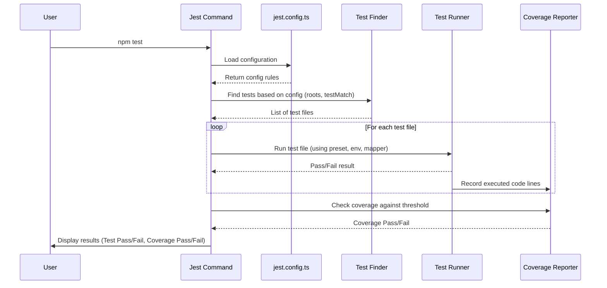

# Chapter 7: Testing Configuration (Jest)

In the [previous chapter](06_logger_utility_.md), we learned about the [Logger Utility](06_logger_utility_.md), our application's diary for recording important events and errors. Now we have several pieces working together: the [Lambda Handler (Patient Appointments)](01_lambda_handler__patient_appointments__.md), the [Domain Model (Appointment, Patient)](02_domain_model__appointment__patient__.md), the [Appointment Service](03_appointment_service_.md), the [Appointment Repository Interface](04_appointment_repository_interface_.md) using a [Mock Appointment Repository](05_mock_appointment_repository_.md), and the [Logger Utility](06_logger_utility_.md).

But how do we make sure all these pieces work correctly *now* and *in the future* as we make changes?

## What's the Problem? Trusting Our Code

Imagine building a complex LEGO model following instructions. You finish a section. Does it look right? Did you use the correct bricks? Will it connect properly to the next section? Checking manually every time you add a piece is slow and tedious. What if you accidentally knock something loose later?

Similarly, we've built several software components. We *think* they work. But how can we be sure?
*   Does the Lambda Handler correctly return appointments when given a valid patient ID?
*   Does it correctly return an error if the patient ID is missing?
*   Does the [Appointment Service](03_appointment_service_.md) correctly filter appointments from the [Mock Appointment Repository](05_mock_appointment_repository_.md)?

Checking all these scenarios manually every time we change the code is impractical and prone to errors. We need an automated way to verify our code's correctness.

## The Solution: Automated Testing with Jest

The solution is **automated testing**. We write *code that tests our code*. We use a tool called **Jest**, which is a popular testing framework for JavaScript and TypeScript projects.

Think of Jest as an **automated quality checker**. We provide it with:
1.  **Test Files:** Special files containing instructions on how to test specific parts of our application.
2.  **Configuration:** A rulebook telling Jest *how* to find and run these tests.

Jest then runs these tests automatically, executing parts of our application code with predefined inputs and checking if the outputs or behavior match what we expect. It gives us a report saying "Pass" or "Fail".

## The Rulebook: `jest.config.ts`

Before Jest can run our tests, it needs instructions. This is where the `jest.config.ts` file comes in. It's the central configuration file – the **rulebook and equipment list** for our automated checks.

Think of it like setting up the rules before playing a board game: defining the board, the pieces, how turns work, and how to win.

This file tells Jest things like:
*   Which files are actual test files?
*   How should it handle our TypeScript code?
*   Should it measure how much of our code is tested (code coverage)?
*   Are there any special setup steps needed before running tests?

Let's look at some key parts of our project's `jest.config.ts` file.

**1. Handling TypeScript:**

```typescript
// File: jest.config.ts (Partial)
module.exports = {
    preset: 'ts-jest',
    // ... other settings ...
};
```
*   **`preset: 'ts-jest'`**: Our code is written in TypeScript (`.ts`), but Node.js (where Jest runs) understands JavaScript (`.js`). This line tells Jest to use the `ts-jest` package, which acts like a translator, converting our TypeScript code into JavaScript on the fly so Jest can understand and run it.

**2. Setting the Environment:**

```typescript
// File: jest.config.ts (Partial)
module.exports = {
    // ... other settings ...
    testEnvironment: 'node',
    // ... other settings ...
};
```
*   **`testEnvironment: 'node'`**: This tells Jest that our code is designed to run in a Node.js environment (like on a server or in AWS Lambda), not in a web browser. This ensures Jest simulates the correct environment for our tests.

**3. Finding Test Files:**

```typescript
// File: jest.config.ts (Partial)
module.exports = {
    // ... other settings ...
    roots: ['<rootDir>/src/'], // Start looking in the 'src' folder
    testMatch: ['**/tests/**/*.test.[jt]s?(x)'], // Pattern for test files
    // ... other settings ...
};
```
*   **`roots: ['<rootDir>/src/']`**: Tells Jest the main place to look for source code and tests is within the `src` directory. `<rootDir>` is a placeholder for the project's main folder.
*   **`testMatch: [...]`**: This is the crucial pattern Jest uses to identify which files are tests. It looks for files:
    *   Inside any folder named `tests` (within the `src` directory).
    *   Whose names end with `.test.ts`, `.test.tsx`, `.test.js`, or `.test.jsx`.
    *   Examples: `src/tests/unit/command/patient-appointments.test.ts`, `src/tests/utils/logger.test.ts`.

**4. Understanding Path Shortcuts:**

```typescript
// File: jest.config.ts (Partial)
module.exports = {
    // ... other settings ...
    moduleNameMapper: {
        '^@/(.*)$': '<rootDir>/src/$1', // Map '@/' to 'src/'
    },
    // ... other settings ...
};
```
*   **`moduleNameMapper`**: In our code, we often use shortcuts like `import { logger } from '@/utils/logger';` instead of writing the full relative path. This setting tells Jest that `@/` actually means `<rootDir>/src/`, so it can find the correct files during tests. It's like a map legend for Jest.

**5. Measuring Test Coverage:**

```typescript
// File: jest.config.ts (Partial)
module.exports = {
    // ... other settings ...
    collectCoverage: true, // Turn on coverage reporting
    coverageThreshold: {   // Set minimum goals
        global: {
            branches: 70,  // 70% of code branches (if/else)
            functions: 70, // 70% of functions
            lines: 70,     // 70% of code lines
            statements: 70,// 70% of statements
        },
    },
    // ... other settings ...
};
```
*   **`collectCoverage: true`**: Asks Jest to keep track of which lines of our actual application code (not test code) were executed during the tests.
*   **`coverageThreshold`**: This sets minimum targets. We're telling Jest: "Fail the tests if less than 70% of our code's lines, branches, functions, and statements are covered by these tests." This encourages us to write comprehensive tests.

**6. Special Setup:**

```typescript
// File: jest.config.ts (Partial)
module.exports = {
    // ... other settings ...
    setupFiles: ['<rootDir>/jest.setup.js'], // Run this file before tests
};
```
*   **`setupFiles`**: Specifies setup scripts to run *before* the tests start. Our `jest.setup.js` might contain global setup, like configuring environment variables needed for tests.

## How Jest Uses the Configuration

When you run the test command (often `npm test` or `yarn test`):

1.  **Read Config:** Jest loads `jest.config.ts`.
2.  **Find Tests:** It scans the directories specified in `roots` (`src/`) looking for files matching the `testMatch` pattern.
3.  **Setup:** It runs any scripts listed in `setupFiles` (`jest.setup.js`).
4.  **Transform & Run:** For each test file found:
    *   It uses `ts-jest` (`preset`) to understand the TypeScript.
    *   It uses `moduleNameMapper` to resolve path shortcuts (`@/`).
    *   It runs the test code within the specified `testEnvironment` (`node`).
    *   It keeps track of code execution if `collectCoverage` is true.
5.  **Report Results:** Jest summarizes which tests passed or failed.
6.  **Check Coverage:** If coverage was collected, it compares the results against the `coverageThreshold` and reports success or failure.

Here's a simplified view:



## Example Test Structure

Tests typically live in files like `src/tests/unit/command/patient-appointments.test.ts`. They often look like this:

```typescript
// File: src/tests/unit/command/patient-appointments.test.ts (Simplified)
import { lambdaHandler } from '@/command/lambda/patient-appointments';
// ... other imports ...

// Group tests for the lambdaHandler
describe('lambdaHandler', () => {

    // Define a single test case
    it('should return 400 if patient ID is missing', async () => {
        // 1. Arrange: Set up the input (event without patientId)
        const event = { /* ... create event with missing pathParameters ... */ };

        // 2. Act: Run the code being tested
        const result = await lambdaHandler(event as any);

        // 3. Assert: Check if the output is correct
        expect(result.statusCode).toBe(400); // Expect status 400
        expect(JSON.parse(result.body).message).toBe('Patient ID is missing');
    });

    // ... more 'it' blocks for other scenarios ...
});
```
*   **`describe(...)`**: Groups related tests together (e.g., all tests for the `lambdaHandler`).
*   **`it(...)`**: Defines a specific test scenario (e.g., "should return 400...").
*   **Arrange, Act, Assert**: A common pattern: set up inputs, run the code, check the results.
*   **`expect(...).toBe(...)`**: This is an **assertion**. We *expect* the `result.statusCode` *to be* `400`. If it's not, Jest fails the test.

Notice how we also use mocking (e.g., `jest.mock('@/application/appointment-service')` in the full file) to replace real dependencies with controlled fakes, allowing us to test the `lambdaHandler` in isolation.

## Conclusion

We've learned that automated testing with **Jest** is crucial for ensuring our code works correctly and stays that way. The **`jest.config.ts`** file acts as the central rulebook, telling Jest how to find tests, handle TypeScript, measure coverage, and set up the testing environment.

By defining these rules and writing test cases (like those in `patient-appointments.test.ts`), we create an automated safety net that checks our application's behavior, giving us confidence when building and modifying our code.

This chapter concludes our initial tour through the core components and concepts of the `aws-sam-typescript-bootstrap` project. You've seen how requests flow through the Lambda Handler, how data is modeled, how business logic is handled by services using repository contracts, how mock data helps development, how logging provides visibility, and finally, how testing ensures quality. From here, you can explore deploying the application, replacing the mock repository with a real database, or adding more features!

---

Generated by [AI Codebase Knowledge Builder](https://github.com/The-Pocket/Tutorial-Codebase-Knowledge)