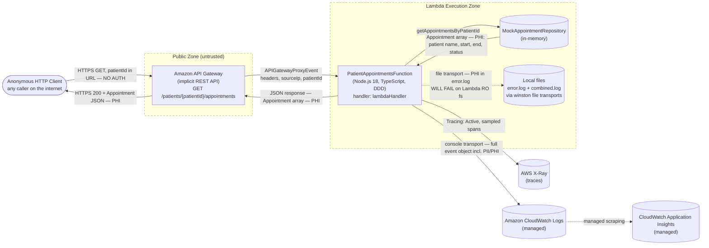

# Data Flow Diagram — aws-sam-typescript-bootstrap

> **PHI workload** — operator declared this codebase is subject to HIPAA (US) and GDPR Article 9 (EU) special-category healthcare data. All boundary crossings carrying appointment / patient data are sensitivity-elevated for the STRIDE walk that consumes this DFD.

## Diagram

The dashed subgraph borders mark **trust boundaries**. Every arrow that crosses a boundary is a candidate for STRIDE analysis. The dotted arrow (`lambda -.-> localfs`) is a **broken flow** — winston's file transports target the Lambda working directory, which is read-only outside `/tmp`. The flow exists in code but will fail at runtime; surface as a Repudiation + Operational threat in STRIDE.

---

## Trust boundaries

| From | To | Authentication mechanism | Data classification |
|------|-----|--------------------------|---------------------|
| Anonymous HTTP Client → API Gateway | **None** — endpoint is open. CORS headers set to `*` for origin, headers, methods. | TLS at the edge only | Path param `patientId` (low-PII pseudonymous UUID, but **enumeration-vulnerable**) |
| API Gateway → Lambda | AWS-internal IAM (implicit invoke permission from SAM Events binding) | IAM role bound by SAM | Full `APIGatewayProxyEvent` — includes headers, sourceIp, requestContext, path/query params |
| Lambda → MockAppointmentRepository | In-process call (no boundary in code; included for completeness) | n/a — same execution context | PHI: `Appointment[]` (patient name, start, end, status) |
| Lambda → CloudWatch Logs | IAM role granted by SAM (default Lambda execution role) | IAM | **PII + PHI in plain logs** — `logger.info('Received event', { event })` writes the entire request event, AND `logger.info('Appointments retrieved', { patientId, count })` writes patient identifiers |
| Lambda → X-Ray | IAM role (`Tracing: Active` in template Globals) | IAM | Trace spans (annotations + metadata may include patientId) |
| Lambda → local filesystem (`error.log` / `combined.log`) | n/a | n/a | **Broken flow** — Lambda root fs is read-only; writes either fail silently or error |
| CloudWatch → Application Insights | AWS-managed | AWS-managed | Log scraping — Application Insights may surface PHI in alarms / dashboards |

### Boundary violations flagged by the operator

| Boundary | Violation | Source |
|----------|-----------|--------|
| Public Internet ↔ API Gateway | Unauthenticated access to an endpoint returning healthcare data | `template.yaml` — `Events.GetAppointments` declares the route with no `Auth:` block; handler does not enforce auth either |
| Lambda → CloudWatch | PHI logged in plaintext (full event + patientId) without redaction | `src/command/lambda/patient-appointments.ts:14`, `:32` — `logger.info(..., { event })` and `logger.info(..., { patientId, count })` |
| Lambda → local fs | Code path that cannot succeed in production | `src/utils/logger.ts:9-10` — winston `File` transports target Lambda's RO root fs |

---

## Data classifications

| Element | Classification | Source | Notes |
|---------|----------------|--------|-------|
| `patient.id` | PII (low — pseudonymous UUID) | `src/domain/patient.ts:2`; operator confirmed UUID, not NHS/MRN | Still PII per GDPR (online identifier); enumeration-vulnerable in current route |
| `patient.name` | PII | `src/domain/patient.ts:2` | Full name of a healthcare patient |
| `appointment.start` / `end` | **PHI** | `src/domain/appointment.ts:5-9` | Health-context activity timeline tied to identifiable patient |
| `appointment.status` | **PHI** | `src/domain/appointment.ts:5` | `booked` / `Cancelled` — behavioural health data |
| `Appointment[]` (response body) | **PHI** | `src/command/lambda/patient-appointments.ts:30` | The whole response is PHI; egress unauthenticated |
| Full `APIGatewayProxyEvent` (logged) | PII + PHI in logs | `src/command/lambda/patient-appointments.ts:14` | Logged via `logger.info` — flows to CloudWatch + (broken) local files |
| `AWS_ACCESS_KEY_ID` / `AWS_SECRET_ACCESS_KEY` | Secrets | `.github/workflows/cd.yml` | Static long-lived keys (OIDC config file exists but unused — see handover) |

No explicit registry at `docs/data-classification.{md,yaml}` — heuristics + operator-confirmed classifications above.

---

## Notes

Each crossing of a trust boundary is where STRIDE threats apply most acutely:

- **Spoofing** — Public ↔ API Gateway crossing has no authentication. Any caller can pretend to be any patient by guessing UUIDs.
- **Tampering** — Inbound payload is just a path param; minimal tampering surface. Outbound JSON not signed (client can't verify).
- **Repudiation** — Logs include PHI + sourceIp + headers (sufficient for action attribution), BUT the file-transport flow is broken so half the audit trail never lands; CloudWatch path works. Worth a fix.
- **Information disclosure** — Three concrete vectors: (a) IDOR via unauth GET, (b) PHI in CloudWatch logs (operator-confirmed PHI workload → HIPAA / GDPR Art.9 exposure), (c) full Error message returned in 500 response body (`err.message` may leak internals).
- **Denial of service** — No rate limiting at API Gateway, no caller throttling. Mock repository is in-memory; cold-start dominates but `Timeout: 3` (seconds) is tight enough that long requests fail fast.
- **Elevation of privilege** — No roles in the system. Anonymous == owner for any patient ID.

The DFD is meant to be **re-drawn as the system evolves** — when a real persistence layer (DynamoDB / Postgres) lands, the data zone grows; when auth lands, the public/backend boundary gains a real authentication mechanism.

Pair this DFD with the STRIDE threat model at [`../audits/threat-model.md`](../audits/threat-model.md) (run `/threat-model aws-sam-typescript-bootstrap` next).

---

## References

- [`container.md`](container.md) — L2 container diagram (sibling, static topology)
- [`../handover-assessment.md`](../handover-assessment.md) — handover context, risks, integration plan
- [Mermaid `flowchart` syntax](https://mermaid.js.org/syntax/flowchart.html)
- [STRIDE — Microsoft Security Development Lifecycle](https://learn.microsoft.com/en-us/azure/security/develop/threat-modeling-tool-threats)

---

Generated by /dfd on 2026-05-16
