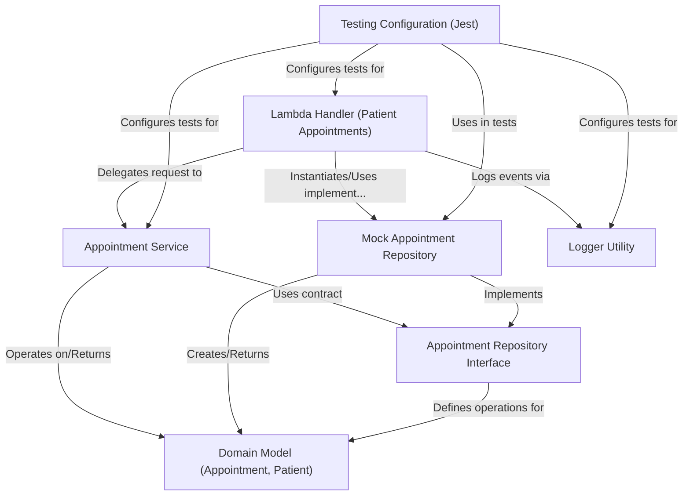

# Tutorial: aws-sam-typescript-bootstrap

This project is an *AWS Lambda function* designed to handle requests for **patient appointments**.
It receives a patient's ID, fetches their appointment data using a structured approach, and returns the information.
The system separates concerns into different layers: **Domain** (like `Patient`, `Appointment`), **Application** (business logic), and **Infrastructure** (data access, like a *mock database* for now).
It also includes utilities for **logging** events and errors, and uses **Jest** for automated testing.

**Source Repository:** [None](None)

## Chapters

1. [Lambda Handler (Patient Appointments)
](01_lambda_handler__patient_appointments__.md)
2. [Domain Model (Appointment, Patient)
](02_domain_model__appointment__patient__.md)
3. [Appointment Service
](03_appointment_service_.md)
4. [Appointment Repository Interface
](04_appointment_repository_interface_.md)
5. [Mock Appointment Repository
](05_mock_appointment_repository_.md)
6. [Logger Utility
](06_logger_utility_.md)
7. [Testing Configuration (Jest)
](07_testing_configuration__jest__.md)

---

Generated by [AI Codebase Knowledge Builder](https://github.com/The-Pocket/Tutorial-Codebase-Knowledge)